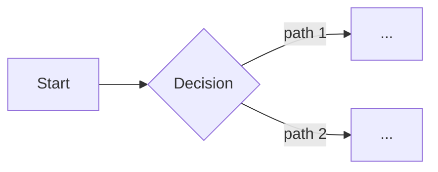

# Agent Plan — Interactive Round-Trip Plan

You are orchestrating the interactive plan workflow: gather requirements via Q&A, assemble a robust plan, present it for TUI review, then execute on approval.

## User's Plan Topic

$ARGUMENTS

## Workflow Overview

The workflow has **5 phases**:

1. **Context** — scan the repo for related code / docs / conventions
2. **Interactive Q&A** — AskUserQuestion to gather goal, scope, constraints, approach, phases, verification, risks
3. **Assemble** — write the plan markdown to `.context/plans/<plan_name>.md`
4. **Review gate** — present via `show_plan` in the TUI; loop on decline, proceed on approval
5. **Execute + completion report** — run the approved phases, then present completion via `show_report`

## Mandatory Plan Review Rule

Before moving from the generated plan to execution, present it through `show_plan` and treat the result as binding.

Call `show_plan` with:
- `file_path`: `.context/plans/<plan_name>.md`
- `title`: `"Plan: {topic}"`
- `mode`: `"plan"`

Parse the result:
- **approved** → proceed to Phase 5 with current file contents
- **edited + approved** → file has been written back to disk; re-read it, then proceed
- **declined** → STOP. Show any comments, ask what to revise. Loop back to Phase 3

Do not proceed to implementation until `show_plan` returns approval.

## Parse Arguments

Extract from `$ARGUMENTS`:
- **plan_topic** — the plan description (required; everything not consumed by flags)
- **plan_name** — `--name NAME` or generate `YYYY-MM-DD-<slug-of-topic>`
- **agent_mode** — `--agent inline|haiku|sonnet|opus` (default: `inline`)

## Storage Location

Project-local — all artifacts live under the git root (or CWD if not a git repo):

```
.context/plans/
├── <plan_name>.md          # the plan itself
├── <plan_name>.qa.md       # Q&A log from Phase 2
└── <plan_name>.completion.json  # completion payload from Phase 5 (retained for audit)
```

Create `.context/plans/` if it doesn't exist.

---

## PHASE 1: Context

Spawn **one** Haiku agent to scan the repository:

```
Agent — Repo Scout:
- Find files/modules/functions relevant to the plan topic
- Note existing patterns, conventions, test styles
- Flag anything that looks like a related in-progress change
- Return: related_files[], existing_patterns[], conventions[], notes
```

Keep this lightweight — plans are single-document and smaller-scope than full specs.

---

## PHASE 2: Interactive Q&A

Use AskUserQuestion. Group questions to minimize round-trips (2–4 questions per call). Cover all of the following before moving on — partial information leads to thin plans:

**Group 1 — Goal & Scope**
- What problem does this solve? What's the success criterion?
- What's explicitly in scope?
- What's explicitly out of scope?

**Group 2 — Constraints & Approach**
- Technical, time, compatibility, or stakeholder constraints?
- Preferred approach/strategy?
- Anything to explicitly avoid?

**Group 3 — Staging & Risks**
- Natural breakpoints — how should this be phased?
- What could go wrong? Any rollback/recovery considerations?
- Dependencies on other work or external systems?

**Group 4 — Verification**
- How will we prove it works? (tests, smoke checks, manual review)
- What's the acceptance gate?

Log every Q&A exchange to `.context/plans/<plan_name>.qa.md` (append-only, ISO timestamps). This file is the audit trail even if the plan is heavily edited later.

---

## PHASE 3: Assemble the Plan

Write `.context/plans/<plan_name>.md` with the full rich structure below. Fill every section — if an answer is "N/A", say so explicitly rather than omitting the section.

```markdown
# Plan: {topic}

## Context
{why we're doing this, the problem, the intended outcome}

## Goal & Success Criteria
- **Goal:** {one-sentence}
- **Success looks like:** {measurable criteria}
- **Non-goals:** {what success explicitly does NOT include}

## Scope
### In scope
- …
### Out of scope
- …

## Approach
### Strategy
{high-level plan of attack}

### Architecture / Flow


### Alternatives considered
{briefly — 1-2 sentences per alternative and why rejected}

## Phase 1: {name}
### Tasks
- [ ] …
- [ ] …
### Verification
{how we know this phase is done}
### Files touched
- `path/to/file.ext` — {what changes}

## Phase 2: {name}
…

## Phase N: {name}
…

## Risks & Mitigations
| Risk | Likelihood | Impact | Mitigation |
|------|------------|--------|------------|
| …    | low/med/hi | low/med/hi | … |

## Verification Plan
- **Unit** — …
- **Integration** — …
- **Smoke / manual** — …
- **Acceptance gate** — …

## Rollback / Recovery
{how to unwind if something goes wrong mid-execution}

## Open Questions
- …
```

---

## PHASE 4: Plan Review (TUI — Mandatory)

Present the plan for review using Pi's built-in TUI viewer:

Call `show_plan` with:
- `file_path`: `.context/plans/<plan_name>.md`
- `title`: `"Plan: {topic}"`
- `mode`: `"plan"`

Parse the result:
- **approved** → proceed to Phase 5 with current file contents
- **edited + approved** → file has been written back to disk; re-read it, then proceed
- **declined** → STOP. Show any comments, ask what to revise. Loop back to Phase 3 to update the markdown, then re-present. Never execute a declined plan.

---

## PHASE 5: Execute & Completion Report

### Step 5.1 — Re-read the approved plan

Read `.context/plans/<plan_name>.md` from disk (the viewer may have edited it). Parse out `## Phase N` sections into an ordered task list. For each Phase section, extract the `### Tasks` checklist and `### Files touched` list.

### Step 5.2 — Execute

Branch on `agent_mode`:

- **`inline`** (default) — execute phases sequentially in this session using Read/Write/Edit/Bash/Grep/Glob. Follow any TDD hints from the plan's Verification Plan. After each phase, update `.context/plans/<plan_name>.md` in place: mark completed tasks with `[x]`.

- **`haiku` / `sonnet` / `opus`** — invoke `/haiku --model <tier> "Execute the approved plan at .context/plans/<plan_name>.md. Follow the phases in order."`. Wait for the team to return.

### Step 5.3 — Show completion report

After execution, present a completion report using `show_report`:

- `title`: `"Completion: {topic}"`
- `summary`: What was done, which phases completed, any issues encountered
- `base_ref`: `"HEAD~{n}"` or `"HEAD"` as appropriate

---

## Execution Instructions

**BEGIN NOW by:**

1. Parsing `$ARGUMENTS` for `plan_topic`, `--name`, `--agent`
2. Computing `plan_name` (either `--name` or `YYYY-MM-DD-<slug>`)
3. Ensuring `.context/plans/` exists
4. Spawning the Repo Scout Haiku agent (Phase 1)
5. Starting Q&A (Phase 2) — do not skip groups even if the topic looks small

**CRITICAL RULES:**

1. **EVERY SECTION GETS FILLED** — plans are robust. Use "N/A — reason" rather than skip.
2. **NEVER EXECUTE A DECLINED PLAN** — review gate is binding.
3. **RE-READ AFTER EDIT** — if the plan was edited during review, pull the file from disk before executing.
4. **APPEND-ONLY Q&A LOG** — never overwrite `<plan_name>.qa.md`.
5. **INLINE IS DEFAULT** — only spawn `/haiku --model ...` when `--agent` is explicitly set.
6. **ALWAYS CLOSE THE LOOP** — completion report is not optional; it's how the round-trip contract ends.

Start execution now with Phase 1.
